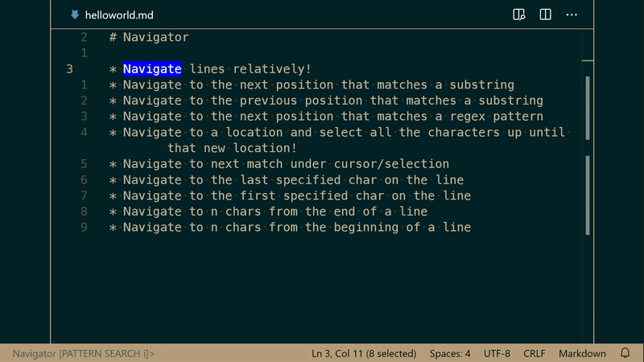

# Change Log
All notable changes to the Navigator extension will be documented in this file.

## Release Notes

### 1.3.0
- New Command - Sticky Cursors

  <kbd>CTRL</kbd> + <kbd>;</kbd> chord <kbd>CTRL</kbd> + <kbd>&</kbd> 

  Sticky cursors allow you to freely move in you in editor with the arrow keys and add cursors abritrarily anywhere in your editor! No mouse required! No `<kbd>CTRL</kbd>` + `CLICK` required, no column requirements, no find/search requirements, just add a cursor anywhere in your editor by pressing space.

  Notes:
  * Press <kbd>space</kbd> to add a sticky cursor
  * Press <kbd>backspace</kbd> while on a sticky cursor to remove it
  * Press <kbd>enter</kbd> while using the sticky cursor to apply the cursors
  * Press <kbd>espace</kbd> at any time to cancel the sticky cursor command and active cursors
  * Use the `navigator.stickyCursorStyle` setting to alter the display style

  Demo:

  

### 1.2.1
- Patch to support recursive search for the following commands:
    * Pattern Search
    * Substring search
    * Cursor Match
    * Go to Next/Prev Symbol

  Recursive search, when enabled, allows you to jump to the top of the document to continue searching when search queries reach the end of the document.

### 1.2.0

- Adds a new command to center the editor on the active cursor line, if applicable and if there is room to scroll 
  Use `CTRL + ;` chord `CTRL + m`

### 1.1.0

- Added command support to navigate to prev/next empty line
    - Use `CTRL + ;` chord `CTRL + [` for closest previous empty line
    - Use `CTRL + ;` chord `CTRL + {` for closest previous empty line with selection
    - Use `CTRL + ;` chord `CTRL + ]` for closest next empty line
    - Use `CTRL + ;` chord `CTRL + }` for closest next empty line with selection

- Jump lines retains cursor character index if the line jumping to has the same position now. 

### 1.0.0
- Initial release

-----------------------------