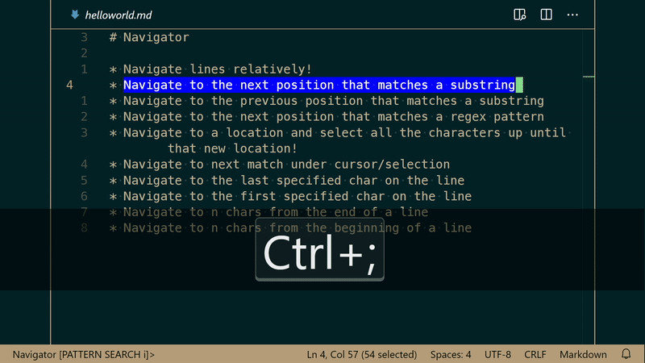
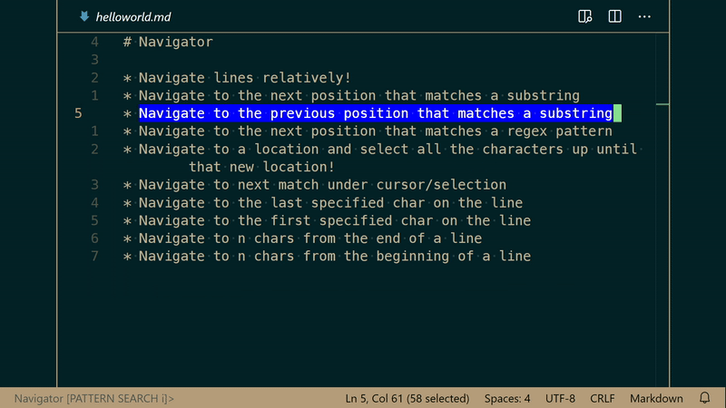
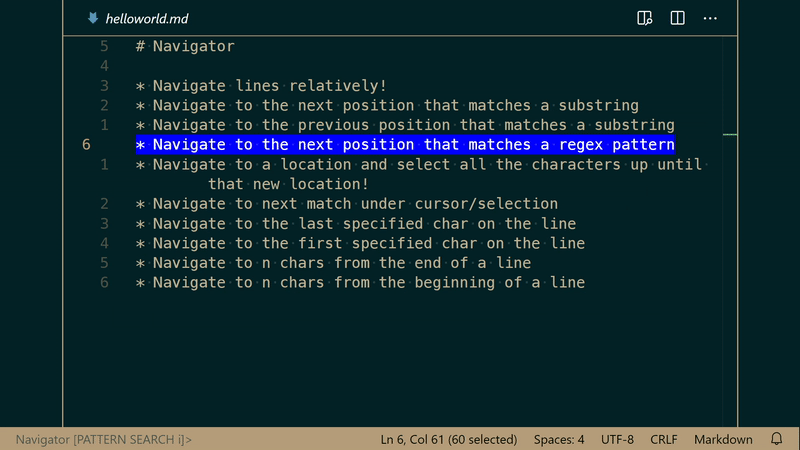
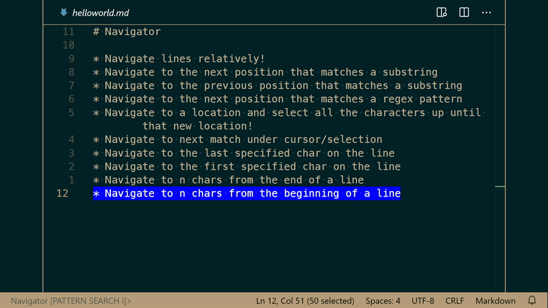
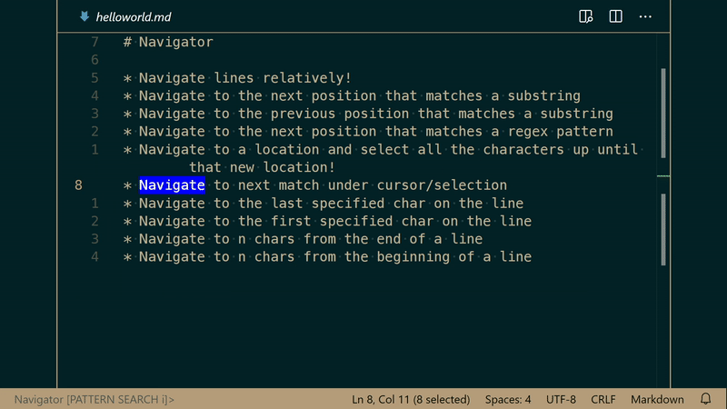

# Navigator

Re-define how your cursor navigates

Dependency-free, intuitive, multi-command, granular cursor-navigation directly from your status bar with a terminal-like feel.


# Features

- Status bar 'terminal-like' command navigator. Activate Navigator with <kbd>CTRL</kbd> + <kbd>;</kbd>, then pick a command type and execute it!
- Dependency-free, minimal overhead to keep Navigator lightweight
- Configurable to your coding style/preferences
    - Keybind customizable
    - User configurations
    - Language specific configurations for sequences
- Supports history (press up and down once Navigator is activated to scroll through your history of commands just like any terminal)
- After a command has been executed you can quickly repeat the same command with <kbd>CTRL</kbd> + <kbd>SHIFT</kbd> + <kbd>;</kbd>, without activating Navigator
- Numerous [commands](#commands) to navigate vscode
    - jump lines relatively and intuitively
        - for example, to jump 5 lines from cursor position, activate the `jumplines` command and type 5
        - to jump 5 lines _behind_ the cursor position, activate the `jumplines` command and type -5
    - jump to prev/next main symbols
    - jump n characters from the end of line
    - jump n characters from the start of line
    - jump to prev/next match of cursor selection/char
    - jump to the last position of a given char
    - jump to the first position of a given char
    - jump to a prev/next position of a provided substring
    - jump to a prev/next position of a provided regex pattern
- Create a sequence of navigator commands to execute consecutively
    - also supports other vscode commands

# Extension Settings

This extension contributes the following settings:

* `navigator.defaultCommand`
[enum&lt;NavigatorCommand>] <br>
Default : PATTERN SEARCH

  Navigator automatically sets the command type each time it's activated. By default, this command is PATTERN SEARCH (or regex search, forwards). You can change the default command that is used to any valid [Navigator command](#commands).

* `navigator.activateWithMostRecentCommand`
[boolean]<br>
Default : true
  
  This always activates Navigator with the most recently used command.
  > Note: This does not override `navigator.defaultCommand` for initial editor states

* `navigator.deactivateNavigatorOnEditorChange`
[boolean]<br>
Default : true
  
  This deactiavtes Navigator when you change text editors

* `navigator.defaultIgnoreCase`
[boolean] <br>
Default : true

  Each time Navigator is activated it defaults to a specified command and, if the command is applicable, case sensitivity search. By default, case is ignored. To enable strict case match, set this to false. Supported commands are annotated below.

* `navigator.activateWithPreviousCaseSensitivity`
[boolean]<br>
Default : false
  
  When enabled, this always activates Navigator with the most recently used case sensitivity state. For example if you toggle the case to be strict case match and then cancel Navigator, then re-activate Navigator, it will still be case-sensitive. Otherwise it reverts to `navigator.defaultIgnoreCase` setting.

* `navigator.feedbackStyle`
[enum]<none, status bar, notification><br>
Default: none 

  The type of feedback provided to you in the case there is a successful or unsuccessful event. For example, if you type in an invalid regex pattern or a regex pattern produces no matches, feedback would be given to you according to this setting.
  

  * <b>status bar</b>: You will be visually notified of errors by changing your status bar color. For example, if you type an invalid regex pattern your status bar color will change to a soft red to notify you visually, then quickly revert back to your preferences.
  * <b>notification</b> : You will be notified with vscodes notification boxes

  Additionally, you can hover over the Navigator status bar title for more details in a tooltip. 

* `navigator.feedbackOnErrorOnly`
[boolean] <br>
Default: true

  In the event that `navigator.feedbackStyle` is set to anything other than none, you can ensure you are only notified of error events by enabling this setting.

* `navigator.stickyerrors`
[boolean] <br>
Default: true

  Sticky errors do not unfocus Navigator. For example, if you enter an invalid regex or no matches are found, Navigator will stay focused so you can delete or alter the pattern accordingly to quickly resubmit a command.

  This setting works even if `navigator.feedbackStyle` is set to 'none' 

* `navigator.maxhistory`
[int]<10..50><br>
Default: 10

  Limit the amount of history indices to scroll through and retain across your session.

* `navigator.resetHistoryIndex`
[boolean] <br>
Default: true

  Reset the history index each time Navigator is activated. This means anytime you press <kbd>UpArrow</kbd> after Navigator gets activated, it will always go to the most recent command in your history. Otherwise, if you were scrolling through history in a previous Navigator instance, it will maintain that history index next time you re-activate Navigator.

* `navigator.activeForeground`
[color-hex]<br>
Default: #000000

  The color of the Navigator command line text when it's activated

* `navigator.inactiveForeground`
[color-hex]<br>
Default: #525252

  The color of the Navigator command line text when it's not focused

* `navigator.multicursorSupportedCommandsMustAllMatch`
[boolean] <br>
Default: true

  When using Navigator commands that support multi-cursors, enabling this setting ensures that ***no*** cursors move or change when any of the lines a cursor is on doesn't have a respective match for the event.

  For example, say there is a cursor on line 3-5 and the `LINE LAST CHAR OCCURRENCE` command is used to jump to the last `)` on each line, but line 4 doesn't contain a `)`, then no cursors will navigate. 

  > Note: In the event this is disabled, and there is not a match on a line, like line 4 in the above example, then all the cursors that do match will navigate accordingly (3 and 5 in the example), but the ones that do not find a match to navigate to will be cancelled and removed from the editors selections. 

* `navigator.allowableSymbols`
[array&lt;string&gt;] <br>
Default: [Class, Constructor, Enum, Function, Method, Namespace, Struct] <br>
Notes:
    * Supports per-language configuration

    For the `Navigate to Prev/Next Symbol` command, this restricts the symbols permitted.

* `navigator.sequence1`
[array&lt;object{ commandId, args? } | string&lt;commandIds&gt;&gt;] <br>
Default: string &lt;commandIds>

  A sequence is simply a macro-like chain of commands that can be executed consecutively to navigate your cursor, all from 1 command. 

  > <b>Note: Sequences support per-language configurations, meaning you can define sequences for specific languages. </b>

  > Note: sequences can not be repeated with the `navigator.repeat` keybind because they contain more than 1 command.

  Sequences accept string values for simple commands that don't take arguments, or object values that require a "commandId" property and optionally args value. 
  
  An example; let's say you frequently jump down 2 lines after a snippet is inserted and then navigate to the 2nd to last char on the line you jump to you can set a sequence to automatically handle this. 

  To demonstrate what that would look like in `settings.json`:
  ```json
  {
    "navigator.sequence1" : [
        {
            "commandId" : "navigator.jumplines",
            "args" : {
                "value" : 2
            }
        },
        {
            "commandId" : "navigator.nth-line-char",
            "args" : {
                "value" : -2
            }
        }
    ]
  }
  ```

  Additionally, this configuration supports *any* valid commandId. To demonstrate with the same example above, but you delete the character using the built in vscode command and then save:
  ```json
  {
    "navigator.sequence1" : [
        {
            "commandId" : "navigator.jumplines",
            "args" : {
                "value" : 2
            }
        },
        {
            "commandId" : "navigator.nth-line-char",
            "args" : {
                "value" : -2
            }
        },
        "deleteRight",
        "workbench.action.files.save"
    ]
  }
  ```

  > Note: Although sequences support any command, it does not monitor for correctness or validate usage. Please ensure you are using non-navigator commands according to their standards and circumstances.

  > Note: Some navigator commands are omitted if found to prevent recursion and errors

* `navigator.sequence2`
See navigator.sequence1

# Commands

## Activate Navigator
<kbd>CTRL</kbd> + <kbd>;</kbd><br>
Notes:
* Press <kbd>CTRL</kbd> + <kbd>c</kbd> to copy the Navigator value at any time
* Press <kbd>UpArrow</kbd>/<kbd>DownArrow</kbd> at any time to scroll through you executed command history

This is the command to activate navigator to start listening for values or command types.

You will know when Navigator is activated when the status bar text color changes to black:

To switch to another command type other than the default, use the appropriate chorded keybind *after* Navigator has been activated, unless otherwise specified. All commands below show if they require to be chorded or not. 

For example, the default command is `PATTERN SEARCH` so when you activate Navigator the status bar will show the following:

`Navigator [PATTERN SEARCH]>`

To switch to another Navigator command type, you can execute its identifying keybind *at any time* after Navigator has been activated. Taking the previous example; if you want to jump lines instead you would now press <kbd>CTRL</kbd> + <kbd>j</kbd>:

`Navigator [JUMP LINES]>`

---

## Navigate Lines (relatively)
<kbd>CTRL</kbd> + <kbd>;</kbd> chord <kbd>CTRL</kbd> + <kbd>j</kbd><br>
Value: Integer
Notes:
* Use a negative number to jump backwards
* Use a positive number to jump forwards

Jump number of lines forwards or backwards from current cursor position, using relative numbers. 

The value is positive to jump down or negative to jump back.


---

## Reverse/Forwards Navigate to Substring Match
Forwards: <kbd>CTRL</kbd> + <kbd>;</kbd> chord <kbd>CTRL</kbd> + <kbd>s</kbd><br>
Reverse: <kbd>CTRL</kbd> + <kbd>;</kbd> chord <kbd>CTRL</kbd> + <kbd>S</kbd><br>
Value: substring to query <br>
Notes: 
* Toggle case sensitivity with <kbd>ALT</kbd> + <kbd>c</kbd>

Jump to the nearest substring match, forwards or reverse.

Forward Search:



Reverse Search:



---
## Navigate to Match via Regex
Forwards: <kbd>CTRL</kbd> + <kbd>;</kbd> chord <kbd>CTRL</kbd> + <kbd>r</kbd><br>
Reverse: <kbd>CTRL</kbd> + <kbd>;</kbd> chord <kbd>CTRL</kbd> + <kbd>R</kbd><br>
Value: regex pattern <br>
Notes:
* Toggle case sensitivity with <kbd>ALT</kbd> + <kbd>c</kbd>



---
## Navigate to a Char Nearest To the Start/End of the Line From Cursor
Start: <kbd>CTRL</kbd> + <kbd>;</kbd> chord <kbd>CTRL</kbd> + <kbd>^</kbd><br>
End: <kbd>CTRL</kbd> + <kbd>;</kbd> chord <kbd>CTRL</kbd> + <kbd>$</kbd><br>
Value: char <br>
Notes: 
* Supports multiple cursors
* Toggle case sensitivity with <kbd>ALT</kbd> + <kbd>c</kbd>

Jump to the first found index of a char to current cursor position, starting at the end or beginning of the line.

This does not overlap the cursor position. 

For example, if you query for a char starting from the end of the line and that char does not exist at the end of the line but exists before the cursor start position, it will not navigate to the char.

To demonstrate, the following cursor would not move, because the cursor is after the letter:

`Navigator [LINE LAST CHAR OCCURRENCE]> w`
```
hello world█! foo bar
```
First Char:


Last Char:


---

## Navigate to the `nth` Char On the Current Line 
<kbd>CTRL</kbd> + <kbd>;</kbd> chord <kbd>CTRL</kbd> + <kbd>#</kbd><br>
Value: Integer <br>
Notes: 
* Supports multiple cursors
* Use a negative number to start from the end of the line
* Use a positive number to start from the beginning of the line
* Unlike `LINE LAST/FIRST CHAR OCCURRENCE` command, this can overlap the cursor's position. 

Jump to the specified index starting from the first non-whitespace character on either direction of the line. You can jump to whitespaces, but the numbering begins starting at the first non-whitespace char

From last non-whitespace character:


From first non-whitespace character:



---

## Navigate to the Previous/Next Cursor Match
Next: <kbd>CTRL</kbd> + <kbd>;</kbd> chord <kbd>CTRL</kbd> + <kbd>n</kbd><br>
Previous: <kbd>CTRL</kbd> + <kbd>;</kbd> chord <kbd>CTRL</kbd> + <kbd>N</kbd><br>
Value: None <br>

Immediately jump to the next/previous position of the same current cursor character/selection.



---

## Navigate To Previous/Next Symbol
Next: <kbd>CTRL</kbd> + <kbd>;</kbd> chord <kbd>CTRL</kbd> + <kbd>DownArrow</kbd><br>
Previous: <kbd>CTRL</kbd> + <kbd>;</kbd> chord <kbd>CTRL</kbd> + <kbd>UpArrow</kbd><br>
Value: None <br>
Notes:
- Doesn't unfocus Navigator. 
- Can be repeated without reactivating Navigator or using the repeat keybind
- Per-language configuration support

Jump to the previous or next symbol found from cursor position for languages that support symbols.

To limit quantity of navigations, the following main symbols are checked for by default:

* Class
* Constructor
* Enum
* Function
* Method
* Namespace
* Struct


---

## Repeat the Last Used Command
<kbd>CTRL</kbd> + <kbd>SHIFT</kbd> + <kbd>;</kbd><br>

Unless otherwise specified, this uses the commands value as well.

# Command Palette Commands

## Pick History & Execute

  Pick an item from your history to execute. This does not require Navigator to be activated.

## Sequence 1-2

  Execute a sequence of commands defined in your settings